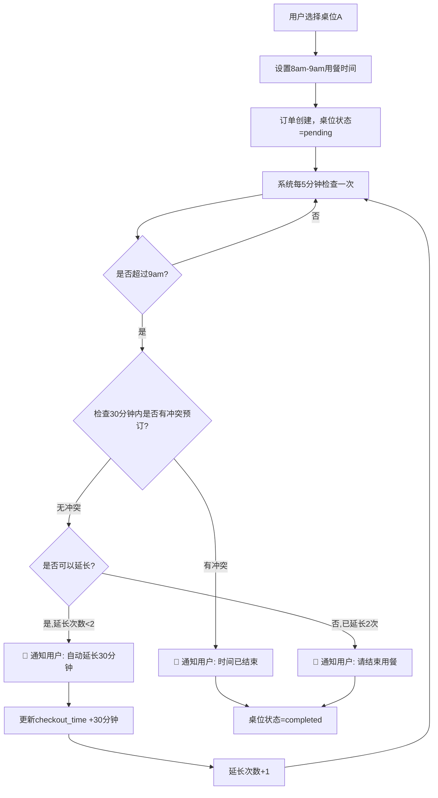

# 🍽️ 桌位自动化管理系统 - 完整指南

## 📋 系统概述

你的桌位自动化管理系统已经完全实现！该系统可以：

-   ✅ **自动检查超时**: 每 5 分钟检查是否有用户超过预定用餐时间
-   ✅ **智能冲突检测**: 检查 30 分钟内是否有其他用户预订同一桌位
-   ✅ **自动延长**: 无冲突时自动延长 30 分钟，最多延长 2 次(1 小时)
-   ✅ **强制结束**: 有冲突或超过最大延长次数时通知用户结束用餐
-   ✅ **实时通知**: 自动发送延长和结束通知
-   ✅ **详细日志**: 记录所有操作历史

## 🚀 业务流程示例

### 场景：用户 A 选择桌位 A，设置 8am-9am 用餐时间



## 🛠️ 系统组件

### 1. 核心服务类

-   **`TableManagementService`**: 处理所有桌位自动化逻辑
-   **路径**: `app/Services/TableManagementService.php`

### 2. 定时任务命令

-   **`CheckTableReservations`**: 定期检查过期订单
-   **路径**: `app/Console/Commands/CheckTableReservations.php`

### 3. 数据库结构

基于 `orders` 表，包含以下桌位相关字段：

```sql
table_id                 -- 桌位ID
table_name              -- 桌位名称快照
dining_date             -- 用餐日期
checkin_time            -- 预计入座时间
checkout_time           -- 预计离座时间
guests_count            -- 客人数量
auto_extend_count       -- 自动延长次数(最多2次)
total_extended_minutes  -- 总延长分钟数
table_status            -- 桌位状态(pending/completed/cancelled)
requires_table          -- 是否需要桌位(dine-in订单)
```

## 🎯 API 端点

### 1. 获取桌位状态

```http
GET /api/tables
```

返回所有桌位及其当前状态

### 2. 获取可用桌位

```http
GET /api/tables/available
```

返回可以预订的桌位列表

### 3. 手动处理过期订单

```http
POST /api/tables/process-expired
Content-Type: application/json

{
  "dry_run": false  // true=仅显示会执行的操作，false=实际执行
}
```

### 4. 获取单个桌位状态

```http
GET /api/tables/{id}/status
```

### 5. 手动入座/结账

```http
POST /api/tables/checkin
POST /api/tables/checkout
Content-Type: application/json

{
  "order_id": 123
}
```

## ⚙️ 系统操作

### 启动自动化系统

1. **启动定时任务**:

```bash
cd backend
php artisan schedule:work
```

2. **手动测试**:

```bash
# 查看会执行的操作（不实际执行）
php artisan tables:check-reservations --dry-run --detailed

# 实际执行处理
php artisan tables:check-reservations
```

### 查看系统日志

```bash
# Laravel主日志
tail -f storage/logs/laravel.log

# 桌位管理专用日志
tail -f storage/logs/table-reservations.log

# 每小时详细日志
tail -f storage/logs/table-reservations-hourly.log
```

## 🔧 配置说明

### 定时任务配置

在 `routes/console.php` 中配置：

```php
// 每5分钟执行一次基础检查
Schedule::command('tables:check-reservations')
    ->everyFiveMinutes()
    ->withoutOverlapping()
    ->runInBackground()
    ->appendOutputTo(storage_path('logs/table-reservations.log'));

// 每小时执行一次详细检查
Schedule::command('tables:check-reservations --detailed')
    ->hourly()
    ->withoutOverlapping()
    ->runInBackground()
    ->appendOutputTo(storage_path('logs/table-reservations-hourly.log'));
```

### 业务规则配置

-   **自动延长时间**: 30 分钟
-   **最大延长次数**: 2 次 (总共 1 小时)
-   **冲突检查窗口**: 30 分钟
-   **检查频率**: 每 5 分钟

这些可以在 `TableManagementService` 中修改。

## 🧪 测试指南

### 1. 运行测试脚本

```bash
# 系统状态测试
php test_table_automation.php

# 完整流程演示
php demo_table_automation.php

# API端点测试
php test_api_automation.php
```

### 2. 创建测试数据

通过前端下单或直接在数据库中插入测试订单。

### 3. 验证自动化逻辑

1. 创建一个超时的订单
2. 运行 `php artisan tables:check-reservations --dry-run --detailed`
3. 检查输出是否符合预期
4. 运行实际处理命令

## 📱 前端集成

### 桌位状态显示

-   **绿色**: 可用
-   **红色**: 用餐中 (之前的 pending 状态)
-   **灰色**: 维护中

### 实时更新

前端可以定期调用 `/api/tables` 来获取最新的桌位状态。

## 🔔 通知系统

### 当前实现

-   记录详细日志到 `storage/logs/laravel.log`

### 扩展建议

可以在 `TableManagementService` 的通知方法中集成：

-   邮件通知
-   短信通知
-   推送通知
-   WebSocket 实时通知

```php
// 在 sendAutoExtensionNotification() 方法中添加
NotificationService::send($order->user, 'auto_extension', [
    'table_code' => $order->table->table_code,
    'extended_minutes' => $minutes,
    'new_checkout_time' => $order->checkout_time
]);
```

## 🚨 故障排除

### 常见问题

1. **定时任务不执行**

    - 检查 `php artisan schedule:work` 是否运行
    - 查看 `php artisan schedule:list` 确认任务配置

2. **自动延长不生效**

    - 检查 `auto_extend_count` 是否已达上限
    - 确认 `checkout_time` 字段是否正确

3. **冲突检测异常**
    - 验证 `checkin_time` 和 `checkout_time` 格式
    - 检查时区设置

### 调试命令

```bash
# 查看当前活跃订单
php artisan tinker
>>> App\Models\Order::where('requires_table', true)->where('table_status', 'pending')->get();

# 手动触发处理
>>> app(\App\Services\TableManagementService::class)->processExpiredOrders();
```

## 🎉 系统特点

-   ✅ **零停机运行**: 定时任务在后台自动运行
-   ✅ **智能决策**: 基于业务规则的自动化处理
-   ✅ **完整日志**: 详细记录所有操作历史
-   ✅ **灵活配置**: 可以调整延长时间、次数等参数
-   ✅ **API 友好**: 提供完整的 REST API 接口
-   ✅ **测试友好**: 支持干运行模式测试

你的桌位自动化管理系统现在已经完全可以投入使用了！🎊
